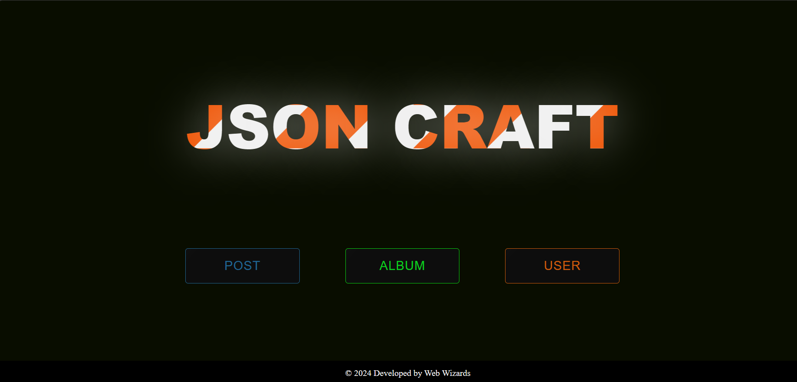

# JSON Craft

JSON Craft is a full-stack web application built to handle JSONPlaceholder API endpoints for managing posts, albums, photos, todos, and user data. It features a responsive and animated UI for an extraordinary user experience.

## Features

- View, create, update, delete posts
- View user albums and photos
- View and manage todos
- View user posts

## Technologies Used

- Frontend: HTML, CSS, JavaScript
- Backend: Node.js, Express.js
- Database: LowDB (embedded database)
- Animation: CSS animations
- Responsive Design: Media queries

## Installation

To run this project locally, follow these steps:
1. Clone the repository:

   ```bash
   git clone https://github.com/yourusername/json-craft.git
   cd json-craft
   npm install
   nodemon index.js

HOME PAGE:


POST PAGE :
(image2.png)

USER ALBUMS PAGE :
(image3.png)